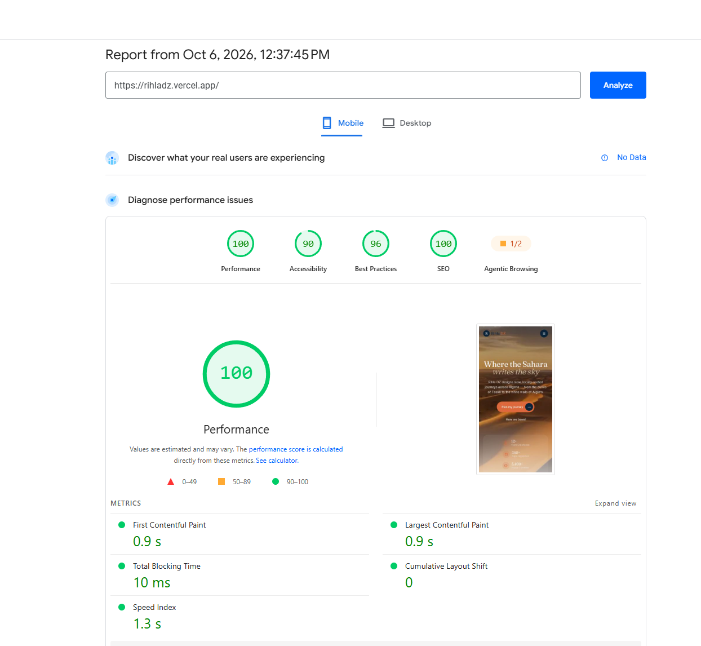

# Rihla DZ

A modern travel and tourism website concept for discovering Algeria through curated destinations, tours, and locally rooted travel experiences.

**Live Demo:** https://rihladz.vercel.app/  
**Repository:** https://github.com/yamami-mohammed-monsif/Rihladz

## Overview

Rihla DZ is a personal portfolio project built to explore how a travel brand can present destinations and experiences through a visually immersive, conversion-focused interface.

The project combines modern frontend development with responsive UI design, reusable components, clear calls to action, trust signals, and interactive visual effects.

## Conversion Strategy

The page was structured around a simple conversion journey: help visitors understand the offer, build trust, reduce uncertainty, and guide them toward a booking-related action.

### CTA hierarchy

A single primary CTA is emphasized in the hero to give visitors a clear next step without competing actions.

### Trust placement

Trust-building statistics are positioned directly below the primary hero CTA to reinforce credibility at the point where visitors are deciding whether to continue.

### Social proof

Testimonials are used to provide social proof and reduce perceived risk before visitors reach the final conversion point.

### Objection handling

An FAQ section addresses common questions and potential objections before the final CTA, reducing friction in the decision-making process.

### Conversion flow

The page follows a deliberate structure:

**Value proposition → Primary CTA → Trust → Destinations & experiences → Social proof → Objection handling → Final CTA**

The goal was to make the next action obvious while giving visitors enough information and reassurance to make a decision.

## Performance & Technical Optimization

Performance was treated as part of the user experience and conversion path, particularly for mobile visitors.

The implementation uses Next.js image optimization, responsive image sizing, reusable components, and a lightweight frontend architecture.

### Mobile Lighthouse / PageSpeed Insights

- **Performance:** 100/100
- **SEO:** 100/100
- **Best Practices:** 96/100
- **Accessibility:** 90/100
- **Largest Contentful Paint:** 0.9s
- **First Contentful Paint:** 0.9s
- **Total Blocking Time:** 10ms
- **Cumulative Layout Shift:** 0
- **Speed Index:** 1.3s

These results were measured using Google PageSpeed Insights and can vary between test runs.

## Performance Evidence

Mobile PageSpeed Insights test:



## Features

- Immersive hero section with Algerian Sahara imagery
- Scroll-based parallax effect in the hero
- Responsive navigation and layouts
- Destination and tour sections
- Testimonials and trust signals
- FAQ section
- Reusable call-to-action sections
- Responsive image handling with Next.js Image
- Component-based page architecture
- Interactive hover states and visual transitions

## Tech Stack

- Next.js
- React
- TypeScript
- Tailwind CSS
- Lucide React
- React Icons
- Vercel

## Project Structure

The main page is composed from reusable sections:

- Header
- Hero
- Popular Tours
- Destinations
- Why Us
- Testimonials
- FAQs
- CTA
- Footer

This keeps the page modular and makes individual sections easier to maintain and iterate on.

## Development Approach

This project was developed as a personal portfolio project with AI-assisted development. AI tools were used during implementation and iteration, while the resulting code and architecture were reviewed and adapted as part of the development process.

## Getting Started

Clone the repository and install the dependencies:

```bash
git clone https://github.com/yamami-mohammed-monsif/Rihladz.git
cd Rihladz
npm install
```

Run the development server:

```bash
npm run dev
```

Open http://localhost:3000 in your browser.

## What I Focused On

The main goals of the project were to practice:

- Building production-style interfaces with Next.js
- Creating reusable React components
- Developing responsive layouts with Tailwind CSS
- Using optimized images and modern Next.js features
- Designing clear user journeys and calls to action
- Combining visual storytelling with practical frontend implementation

## CRO Testing Roadmap

Because this is a portfolio project without production traffic, no conversion uplift is claimed.

If deployed for a real travel business, the next step would be to establish baseline conversion data and test hypotheses such as:

- Hero CTA copy and placement
- Trust-signal positioning
- Number and type of CTAs
- Destination-card engagement
- FAQ placement
- Booking-flow friction
- Mobile vs. desktop conversion behavior

The goal would be to use analytics and controlled experiments to validate which changes actually improve conversion rather than relying solely on design assumptions.
